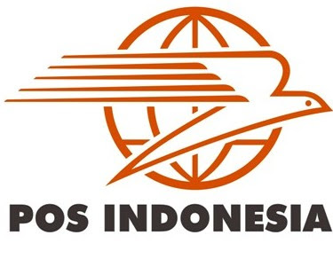

# PT Pos Indonesia (Persero)

> *"Pos Indonesia Menghubungkan Nusantara, Menjangkau Dunia"*

---

## Identitas Murid
- **Nama**: [Valentino Veldenson Lim]
- **Nomor Absen**: [31]
- **Kelas**: [10 TKJ 2]

---

## Profil / Sejarah Singkat Perusahaan
Sejarah Pos Indonesia bermula dari didirikannya Kantor Pos pertama di Batavia (Jakarta) oleh Gubernur Jenderal GW Baron van Imhoff pada tanggal 26 Agustus 1746 untuk menjamin keamanan surat-surat penduduk. Bentuk badan usaha perusahaan ini telah mengalami beberapa kali perubahan, mulai dari Jawatan PTT (Post, Telegraph, and Telephone), PN Pos dan Giro, Perum Pos dan Giro, hingga akhirnya menjadi PT Pos Indonesia (Persero) pada tahun 1995.

---

## Logo Perusahaan

*Logo PT Pos Indonesia berupa simbol Burung Merpati yang sedang terbang dengan bola dunia di belakangnya, didominasi warna Oranye khas Pos Indonesia dan tulisan "POS INDONESIA".*

---

## Visi Perusahaan
Menjadi penyedia solusi logistik, kurir, dan jasa keuangan terpercaya yang terintegrasi secara digital di Indonesia.
    
---

## Misi Perusahaan
- Menyediakan layanan pos, logistik, dan jasa keuangan yang handal, aman, dan berdaya saing tinggi.
- Mengembangkan jaringan logistik terintegrasi berbasis teknologi informasi untuk mendukung pemerataan ekonomi nasional.
- Memberikan nilai tambah bagi para pemangku kepentingan (*stakeholders*) serta mendukung program pembangunan pemerintah.

---

## Produk atau Layanan Utama
- **Pos Courier & Express**: Pos Sameday, Pos Nextday, Pos Reguler, Pos Ekspor.
- **Pos Logistics**: Pengiriman kargo, pergudangan (*freight forwarding & warehousing*).
- **Pos Financial Services**: Pospay (aplikasi keuangan digital untuk pembayaran *bills*, transfer uang, dan jaminan sosial).
- **Layanan Filateli & Benda Pos**: Penjualan prangko, meterai, dan benda filateli.

---

## Kontak / Alamat
- **Kantor Pusat**: Jl. Cilaki No. 73, Citarum, Bandung, Jawa Barat 40115, Indonesia
- **Call Center (HALO POS)**: 1500161
- **Email**: [halopos@posindonesia.co.id](mailto:halopos@posindonesia.co.id)

---

## Tautan Resmi & Media Sosial Perusahaan
- **Website Resmi**: [www.posindonesia.co.id](https://www.posindonesia.co.id)
- **Instagram**: [@posindonesia.ig](https://www.instagram.com/posindonesia.ig)
- **X (Twitter)**: [@PosIndonesia](https://x.com/PosIndonesia)
- **Facebook**: [Pos Indonesia](https://www.facebook.com/PosIndonesia)

---

## Daftar Sumber Referensi
1. Situs Resmi PT Pos Indonesia (Persero): [https://www.posindonesia.co.id](https://www.posindonesia.co.id)
2. Laporan Tahunan (Annual Report) & Profil Perusahaan Resmi PT Pos Indonesia (Persero)

---

## Pernyataan Integritas Akademik
Dengan ini saya menyatakan bahwa data dan informasi dalam berkas `README.md` ini dikumpulkan dari sumber resmi dan terpercaya. Saya menyusun dokumen ini secara mandiri tanpa menyalin milik orang lain.

---

## Link Menuju index.html
Untuk melihat tampilan halaman web resmi hasil dari riset ini, silakan buka berkas `index.html` menggunakan *browser* pilihan Anda (seperti Google Chrome, Mozilla Firefox, atau Microsoft Edge).